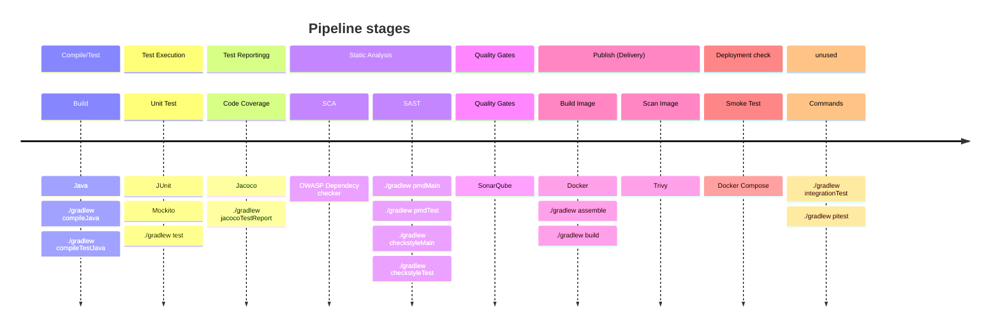

```mermaid
timeline
    title Pipeline stages
    Section Compile/Test
        Build : Java
              : ./gradlew compileJava
              : ./gradlew compileTestJava
    Section Test Execution
        Unit Test : JUnit
                  : Mockito
                  : ./gradlew test
    Section Test Reportingg
        Code Coverage : Jacoco
                      : ./gradlew jacocoTestReport
    Section Static Analysis
        SCA : OWASP Dependecy checker
        SAST : ./gradlew pmdMain
             : ./gradlew pmdTest
             : ./gradlew checkstyleMain
             : ./gradlew checkstyleTest
    Section Quality Gates
        Quality Gates : SonarQube
    Section Publish (Delivery)
        Build Image : Docker
                    : ./gradlew assemble
                    : ./gradlew build
        Scan Image : Trivy
    Section Deployment check
        Smoke Test : Docker Compose
    Section unused
        Commands : ./gradlew integrationTest
                 : ./gradlew pitest
```
