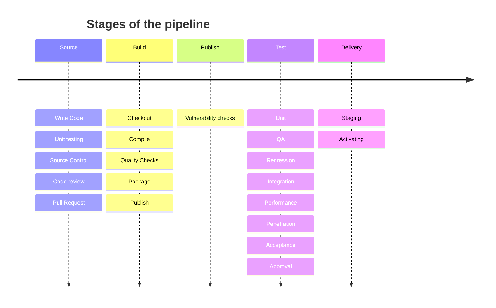

# Pipeline

> NOTE:
> This is preliminary.
>



<!-- ```mermaid
journey
    title Stages of the pipeline
    section Source
        a : c
    section Build
        a :  v
    section Test
        a : a
    section Deploy
        d : x
``` -->


Houses declarations, scripts, data necessary for a full CI/CD pipeline.

Of special note, the term ___deploy___ is not used for the final stage of the pipeline.

Here the term ___deploy___ will be used to represent the installation of an artifact to its target platform.

Deployments happen on every platform and are a prequisite for any form of test, staging or ultimately production use.

A deployment is a generic reusable process not limited to the production platform.  It is desirable to have a repeatable deployment process for every environment.  The deployment process should be exercised early and often through the pipline.

Nothing should happen for the first time during a production installtion.

- Source
- Build
- Test
- Deliver

## Source

Typicallly developers write code, commit it to a source repository then promote (pull) the code which triggers the `Build` phase.

Often there are quality gates that must be satisfied prior to promotion.

## Build

A build will extract source from the repository to a clean environment then compile and link which results in a set of artifacts.

The artifacts are subsequently packaged in a deployable artifact.  Artifacts are typically published to an artifact repository.  This may trigger the next stage, `Test`.

## Test

The built artifact is now subjected to a number of tests.

- Unit Testing
- Integration
- Functional
- Regression
- Performance
- Penetration

Once an artifact has satisfied tests it moves on to the `Deplivery` phase.

## Deliver

Here `Deploy` specifically means deployment to the production environment.  There is a more fundamental meaning of deploy which is the delivery and activation of an artifact to an environment.


## Assemble

Assembles artifacts that will move through the pipeline.
These build upon development artifacts.

## Deploy

Perform deployment of an artifact to a single environment.
Deploy logic is agnostic of an environment.
Environment details are supplied via configuration.

## Infrastructure

Declares the topology of an environment.

## Stages

Declares the stage or phase of pipeline.

## Test

